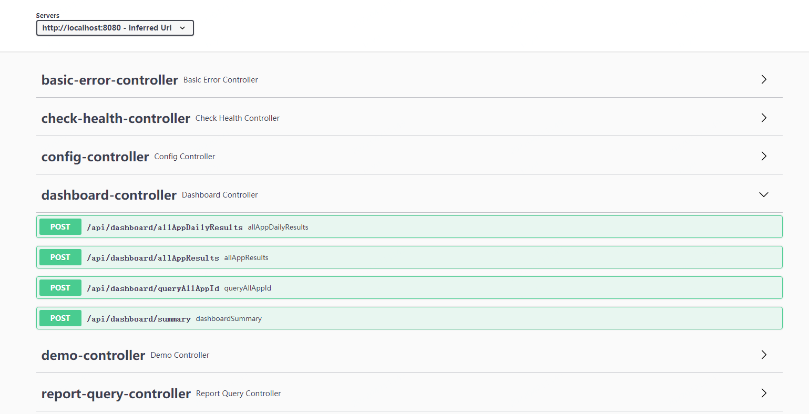

<div align="center"><h1>AREX-SERVICE</h1></div>


This project provides all the interfaces that AREX-UI needs to use. 

# QUICK START
[quick start](https://github.com/arextest/dev-ops#arex-install)
# API DOCUMENTS
We use swagger3 to generate interface description documents. 
Launch the project and visit following address.\
http://(your deployed ip and port)/swagger-ui/index.html\

# LICENSE
```text
Copyright (C) 2022 ArexTest

This program is free software: you can redistribute it and/or modify
it under the terms of the GNU Affero General Public License as
published by the Free Software Foundation, either version 3 of the
License, or (at your option) any later version.

This program is distributed in the hope that it will be useful,
but WITHOUT ANY WARRANTY; without even the implied warranty of
MERCHANTABILITY or FITNESS FOR A PARTICULAR PURPOSE.  See the
GNU Affero General Public License for more details.

You should have received a copy of the GNU Affero General Public License
along with this program. If not, see https://www.gnu.org/licenses/.
```